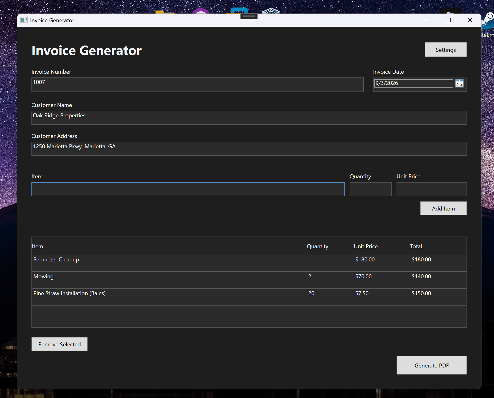
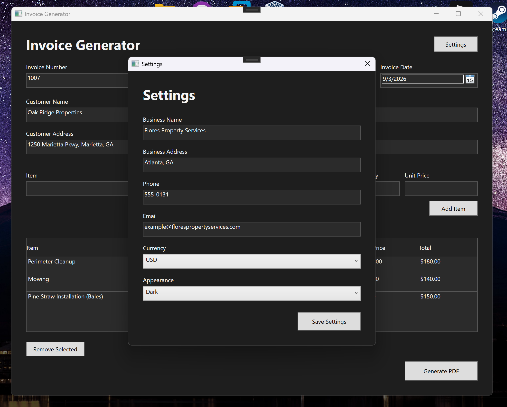
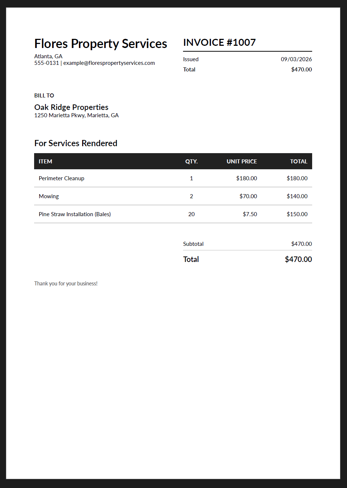

# InvoiceGen

A lightweight desktop invoice generator built with C# and WPF.


InvoiceGen provides a simple interface for creating itemized invoices, managing business information, and exporting professional PDF invoices. The application was built as a practical desktop tool while exploring C#, WPF, persistent application settings, and PDF generation.

## Demo

https://github.com/user-attachments/assets/d4adacb4-907a-4469-9d24-2c8a8ce5466c

## Preview



### Settings



### Generated Invoice



## Features

- Create itemized invoices with automatic total calculations
- Add and remove invoice items
- Export invoices as PDF files
- Automatically open generated PDFs
- Save business information and preferences between sessions
- Light and dark appearance modes
- Support for USD, EUR, GBP, and JPY formatting
- Input validation for invoice and item information
- Customizable business name, address, phone number, and email

## Built With

- **C#**
- **WPF / XAML**
- **.NET 10**
- **QuestPDF** — PDF generation
- **System.Text.Json** — local settings persistence

## Project Structure

```text
InvoiceGen/
├── Models/
│   ├── BusinessSettings.cs
│   ├── Invoice.cs
│   └── InvoiceItem.cs
├── Services/
│   ├── CurrencyFormatter.cs
│   ├── PdfGenerator.cs
│   ├── SettingsService.cs
│   └── ThemeService.cs
├── Converters/
│   └── CurrencyConverter.cs
├── Themes/
│   ├── DarkTheme.xaml
│   └── LightTheme.xaml
├── MainWindow.xaml
├── MainWindow.xaml.cs
├── SettingsWindow.xaml
├── SettingWindow.xaml.cs
├── App.xaml
└── App.xaml.cs
```

## How It Works

InvoiceGen uses WPF for the desktop interface and separates application functionality into models, services, converters, and UI components.

Invoice items are maintained by the application and used to calculate invoice totals automatically. Business information and user preferences are serialized to JSON and stored locally so they persist between sessions.

When an invoice is ready, InvoiceGen passes the invoice and saved business information to a PDF generation service powered by QuestPDF. The resulting document is saved to a location selected by the user and opened automatically.

## Getting Started

### Requirements

- Windows
- .NET 10 SDK
- Visual Studio 2022 or later with .NET desktop development support

### Running the Project

1. Clone the repository:

   ```bash
   git clone <https://github.com/TachyonLover/invoice-generator.git>
   ```

2. Open the solution in Visual Studio.

3. Restore NuGet packages if they are not restored automatically.

4. Build and run the application.

## Motivation

InvoiceGen was originally created to solve a practical need for quickly generating invoices for service work. I used the project as an opportunity to learn more about desktop application development with C# and WPF while building something "real."

## Future Ideas

The current version focuses on lightweight invoice creation and PDF export. Possible future additions include:

- Custom business logos
- Taxes and discounts
- Invoice history
- Additional invoice customization

## License

This project is intended for educational and portfolio purposes.
